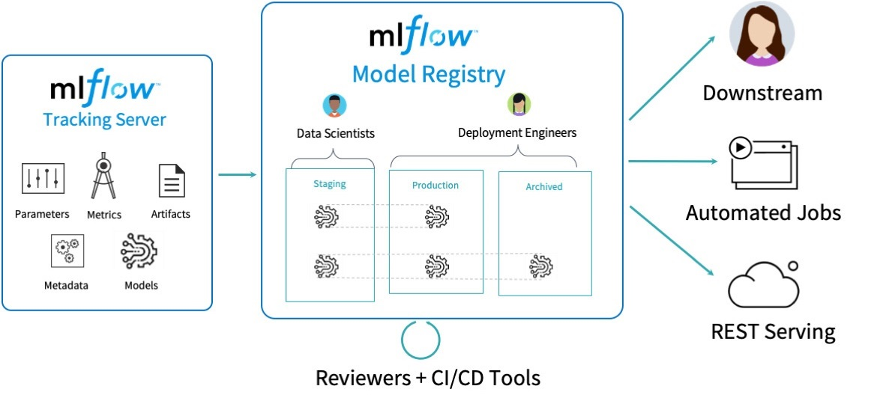

# PySpark-and-mlflow

Here We will see how to implement PySpark for Machine Learning and MLflow for model tracking, registry and expose in production as you can see below:

{: width="50px"}

An ideal enviroment to run or deploy this repo is Databricks, because all dependencies are installed under its runtime, and this tools work perfectly on Databricks due to the clusters of distributed computing that can be configured deploying Databricks on AWS, Azure or GCP.

To run this locally on your machine, please run this steps:

```sh
git clone <ssh code>
virtualenv myenv
source myenv/bin/activate
pip install -r requirements.txt
wget -q https://archive.apache.org/dist/spark/spark-3.4.0/spark-3.4.0-bin-hadoop3.tgz
tar xf spark-3.4.0-bin-hadoop3.tgz
wget https://download.java.net/java/GA/jdk18/43f95e8614114aeaa8e8a5fcf20a682d/36/GPL/openjdk-18_linux-x64_bin.tar.gz
tar -xvf openjdk-18_linux-x64_bin.tar.gz
export JAVA_HOME=/opt/jdk-18
export PATH=$PATH:$JAVA_HOME/bin
pyspark --packages io.delta:delta-core_2.12:0.7.0 --conf "spark.sql.extensions=io.delta.sql.DeltaSparkSessionExtension" --conf "spark.sql.catalog.spark_catalog=org.apache.spark.sql.delta.catalog.DeltaCatalog"
code .
```